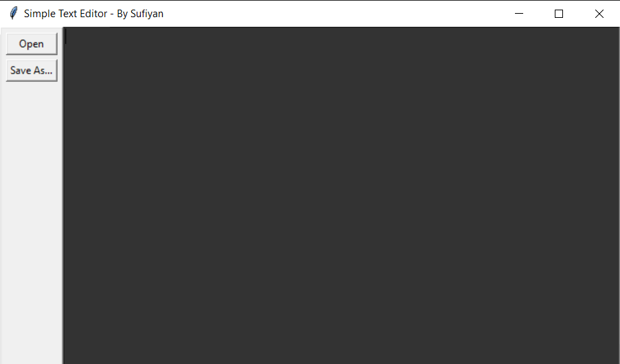
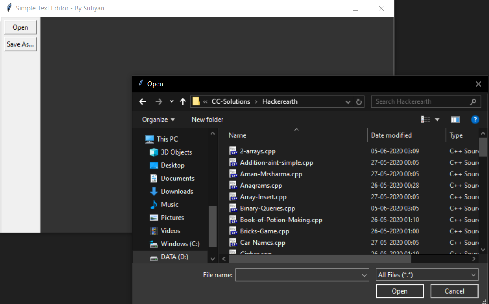
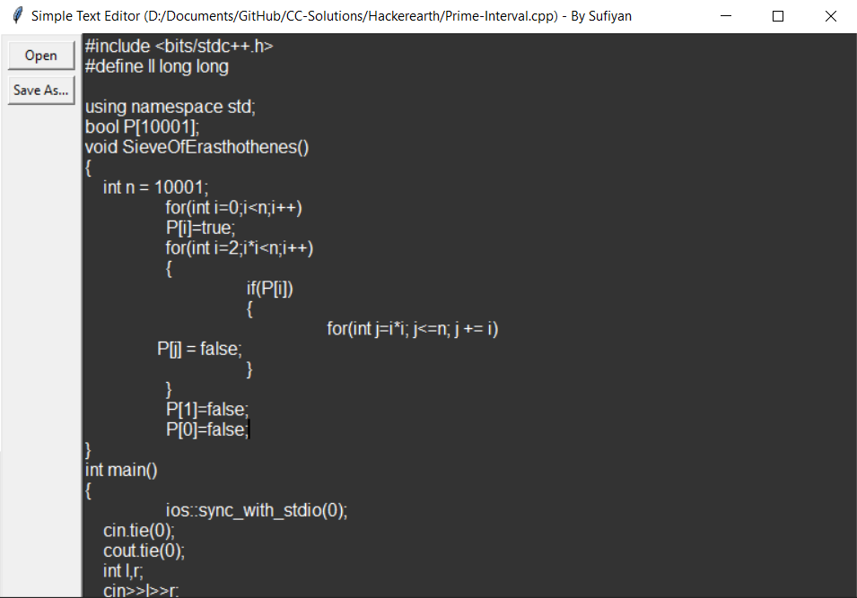

# Text Editor

### Text Editor Written in Python and executed using cx_Freeze and idna
### How to use
- Download The ```.zip``` From [Here](https://github.com/suffisme/TextEditor/archive/master.zip)
- Exract the ```.zip``` file and inside ***Simple Text Editor*** Folder, run **main.exe**

#### Cautions :
- Do not change any file/folder name
- Do not alter relative path of any file/folder

### Functions:
- Editing
- Saving
- Opening

### Screenshots
- Main Screen
- 
- Opening File 
- 
- Viewing File
- 